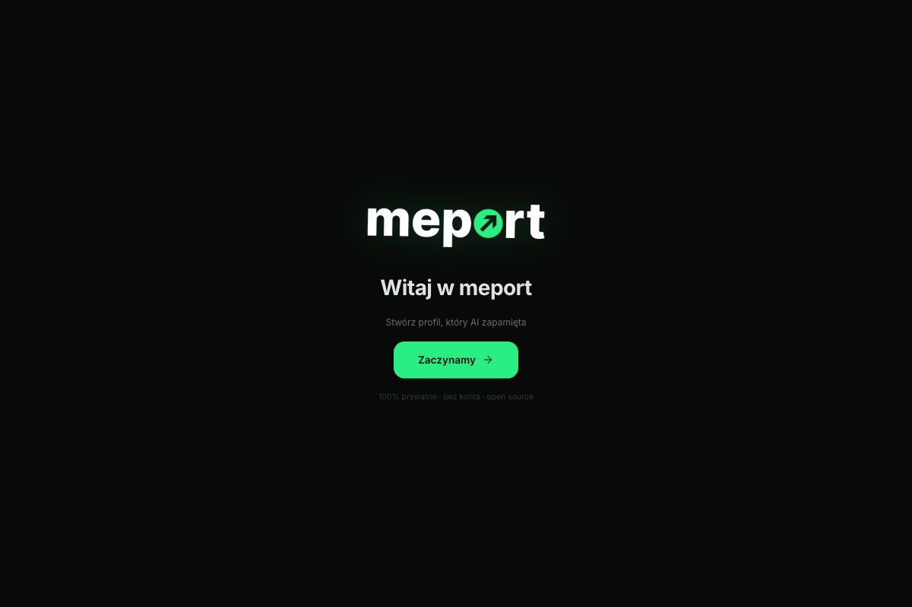
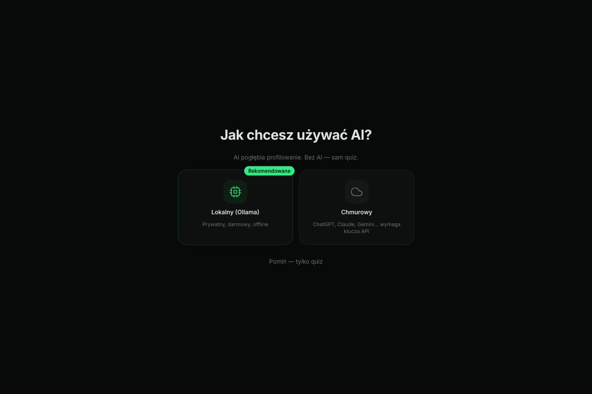
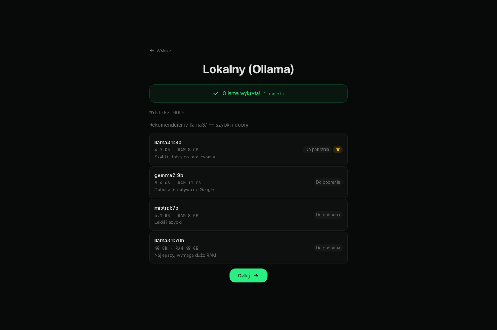
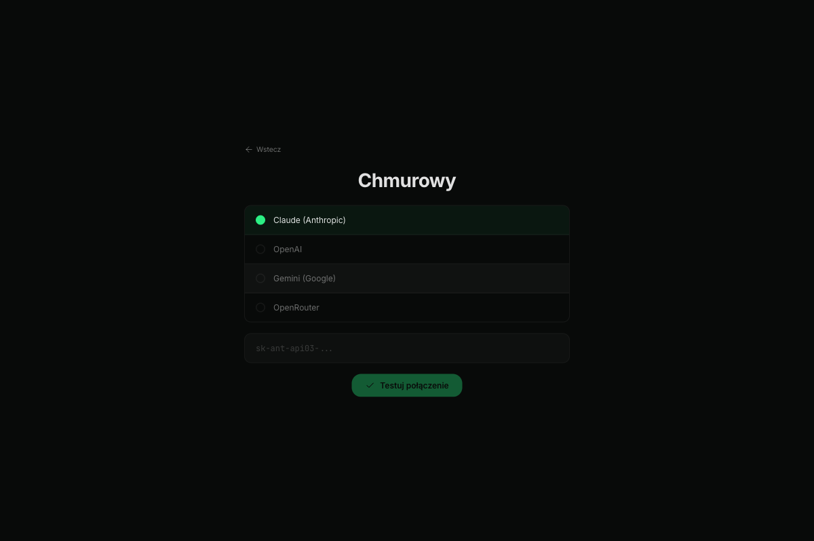
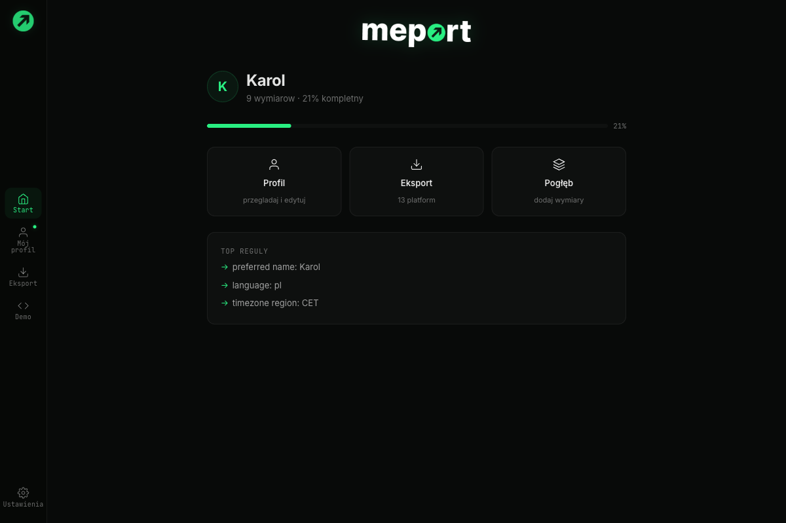
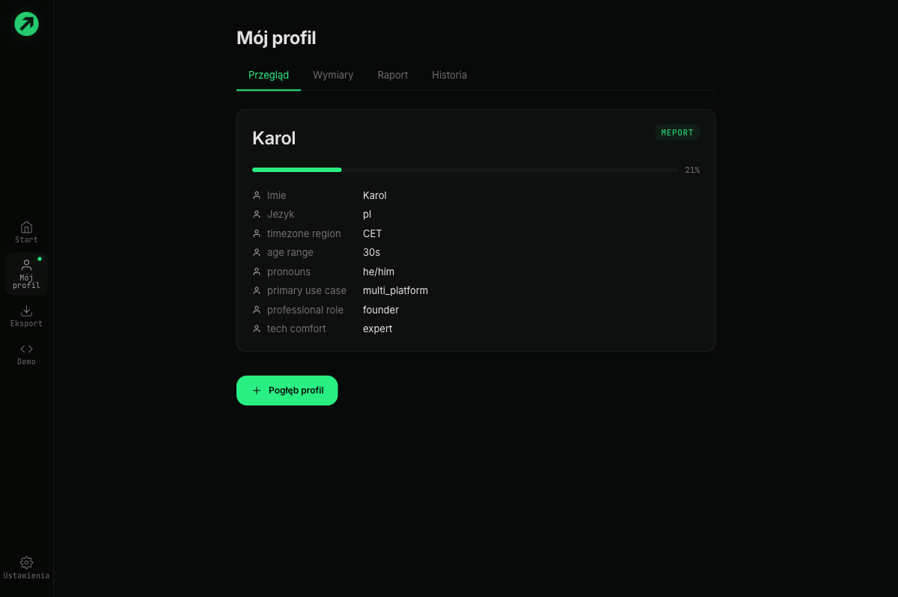
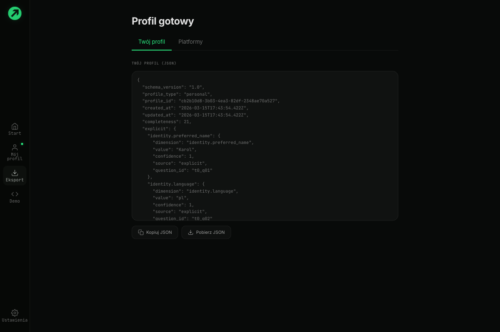
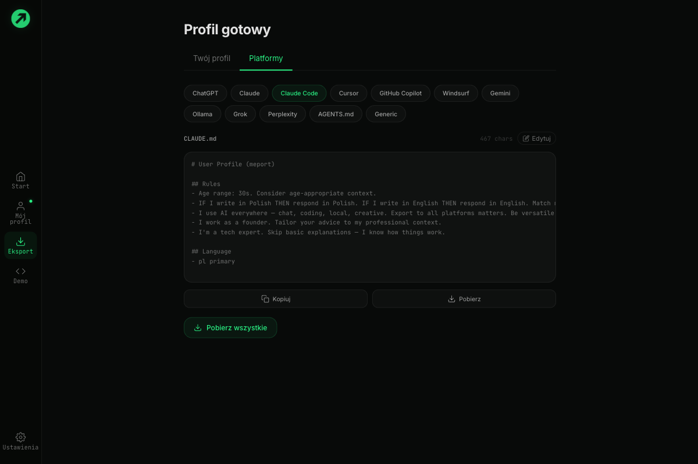
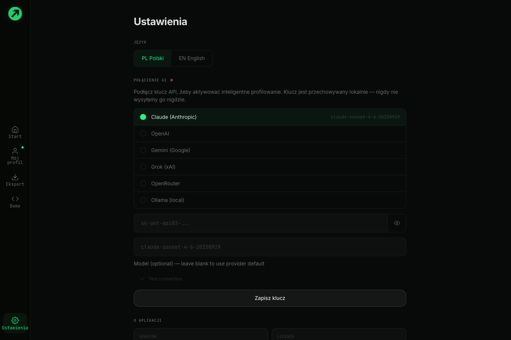

# meport — Getting Started Guide

> Your AI doesn't know you. meport fixes that.

meport creates a portable personality profile that makes every AI remember who you are — your communication style, expertise, preferences, and context. One profile, every platform.

---

## Quick Start (3 minutes)

### 1. Welcome

When you first open meport, you'll see the welcome screen.

Click **Zaczynamy** (Let's start) to begin setup.

---

### 2. Choose Your AI

meport works best with an AI model for deeper profiling. You have three options:

| Option | What it does | Cost |
|--------|-------------|------|
| **Lokalny (Ollama)** | Runs AI on your computer. Private, free, offline. | Free |
| **Chmurowy** | Uses Claude, ChatGPT, Gemini etc. via API key. | Pay-per-use |
| **Pomiń** | Quiz only, no AI. Still creates a good profile. | Free |

**We recommend Ollama** — it's free, private, and works offline.

---

### 3a. Ollama Setup (Local AI)

If you chose Ollama, meport will auto-detect it on your machine.

- **Ollama detected?** Choose a model and click **Dalej** (Next).
- **Not found?** Follow the install guide:
  - **Mac:** `brew install ollama && ollama serve`
  - **Windows:** Download from [ollama.com/download](https://ollama.com/download)
  - **Linux:** `curl -fsSL https://ollama.com/install.sh | sh`

**Recommended models:**
| Model | Size | RAM | Best for |
|-------|------|-----|----------|
| llama3.1:8b | 4.7 GB | 8 GB | Fast, good quality |
| gemma2:9b | 5.4 GB | 10 GB | Google alternative |
| mistral:7b | 4.1 GB | 8 GB | Lightweight |

meport can download models for you — just select and click **Pobierz model**.

---

### 3b. Cloud Setup (API Key)

If you chose Cloud, select your provider and paste your API key.

1. Select provider (Claude, OpenAI, Gemini, or OpenRouter)
2. Paste your API key
3. Click **Testuj polaczenie** to verify
4. Click **Dalej** when connected

Your API key is stored locally — never sent to meport servers (there are none).

---

## Using meport

### Dashboard

After setup, you land on the dashboard showing your profile summary.

- **Profile completeness** — percentage bar showing how much AI knows about you
- **Quick actions** — Profile, Export, Deepen
- **Top rules** — the most important instructions AI will follow

---

### My Profile

View and manage your personality dimensions across 4 tabs.

| Tab | What's inside |
|-----|--------------|
| **Przegląd** (Overview) | Identity card with top dimensions |
| **Wymiary** (Dimensions) | All dimensions grouped by category, editable |
| **Raport** (Report) | AI-generated personality analysis |
| **Historia** (History) | Profile snapshots over time |

Click any dimension to edit it. Click **Pogłęb profil** to answer more questions and improve your profile.

---

### Export

Export your profile to any AI platform. Two tabs:

#### Your Profile (JSON)

The raw meport JSON — our universal format. Copy or download it.

#### Platforms

Select a platform to see the compiled instructions optimized for that specific AI:

- **File-based** (Claude Code, Cursor, Copilot, Windsurf) — Download the file, drop it in your project
- **Clipboard** (ChatGPT, Claude, Gemini, Grok, Perplexity) — Copy and paste into settings

Each platform gets a **different format** optimized for its constraints:
- ChatGPT: 1,500 char limit, two fields (About Me + Rules)
- Claude Code: CLAUDE.md markdown format
- Cursor: .mdc frontmatter format, coding-focused
- Ollama: Modelfile SYSTEM prompt

**Refine with AI** — use the built-in chat to ask AI to adjust any platform's output. Changes are saved per platform and persist.

---

### Settings

- **Language** — Polish or English, auto-detected from browser
- **AI Connection** — Switch providers, update API keys, test connection
- **About** — Version, license (MIT), GitHub link
- **Data** — Backup, restore, delete profile, or permanently delete everything

---

## Privacy

- **Local-first** — profile and settings stored in your browser (localStorage)
- **No accounts** — no registration, no login
- **No tracking** — no analytics, no telemetry
- **No servers** — meport has no backend
- **Open source** — [github.com/zmrlk/meport](https://github.com/zmrlk/meport)

When using Ollama, all AI processing happens on your machine — fully offline. With cloud providers (Claude, OpenAI, etc.), scan data and profile dimensions are sent to the AI provider's API for analysis. This includes file names, app names, system preferences, and (if you enabled the "writing" scan category) text content snippets. You choose what categories to scan and can exclude any before AI analysis runs. API keys are stored in your browser's localStorage — not encrypted.

---

## FAQ

**Q: How long does profiling take?**
A: The initial quiz takes 2-3 minutes (9 questions). With AI, you can deepen through conversation for richer results.

**Q: Can I use meport without AI?**
A: Yes. Skip AI during setup — the quiz alone creates a functional profile.

**Q: How do I update my profile?**
A: Click "Pogłęb" on the dashboard, or edit individual dimensions in Profile > Wymiary.

**Q: Where is my data stored?**
A: Only in your browser's localStorage. To backup: Settings > Pobierz kopię zapasową. To fully delete: Settings > Usuń wszystko.

**Q: Does it work on Windows?**
A: Yes. The desktop app (Tauri) runs on Mac, Windows, and Linux. The web version works in any browser.

---

## Links

- Website: [meport.app](https://meport.app)
- GitHub: [github.com/zmrlk/meport](https://github.com/zmrlk/meport)
- npm: [npmjs.com/package/meport](https://www.npmjs.com/package/meport)
